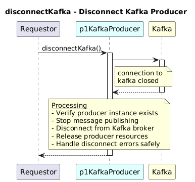

# DisconnectKafka  

### Overview  

Disconnects the Kafka producer and releases all related resources.

### Description  

Gracefully closes the Kafka producer connection and stops all message publishing.

**Module:**  
applicationPattern/applicationPattern/services/KafkaProducerService.js

### **Inputs**
| Name | Type | Description |
|------|------|-------------|
| none | - |-|

### **Output**
| Type | Description |
|------|-------------|
| void | No return value |

### Interface  

NA 

### Diagram  

  

### NPM Module  

[onf-core-model-ap](https://www.npmjs.com/package/onf-core-model-ap)  
