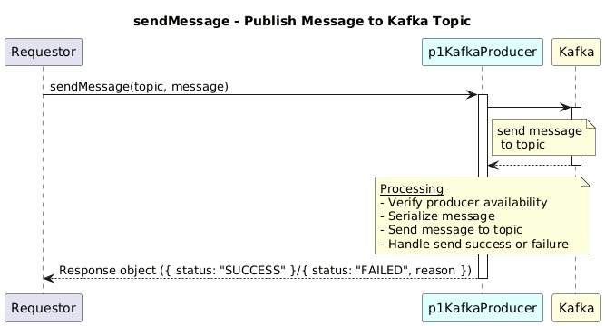

# SendMessage  

### Overview  

Publishes a message to a specified Kafka topic.

### Description  
Serializes the provided message and sends it to the given Kafka topic.
Handles producer availability and message delivery errors.

**Module:**  
applicationPattern/applicationPattern/services/KafkaProducerService.js

### **Inputs**
| Name | Type | Description |
|------|------|-------------|
| topic | String | Kafka topic name|
| message | String/object|Message payload to be published|

### **Output**
| Type | Description |
|------|-------------|
| object | Response object indicating send status |

### Interface  

NA 

### Diagram  

  

### NPM Module  

[onf-core-model-ap](https://www.npmjs.com/package/onf-core-model-ap)  
