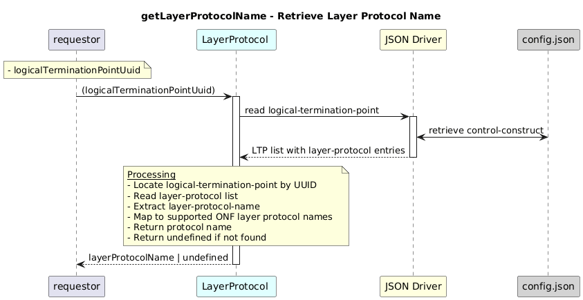

# GetLayerProtocolName  


### Overview  

Retrieves the **layer-protocol name** for a given logical termination point UUID.


### Description  
Logical termination points store one or more **layer-protocol** entries under:

```text
core-model-1-4:control-construct
 └─ logical-termination-point
    └─ layer-protocol
```

This function reads the layer-protocol list of the specified LTP and returns the corresponding layer-protocol-name.

If the logical termination point does not exist or has no layer-protocol entry, the function returns undefined.

**Module:**  
applicationPattern/onfModel/models/LayerProtocol.js

### **Inputs**

| Name | Type | Description |
|------|------|-------------|
| logicalTerminationPointUuid | String | UUID of the logical-termination-point |

### **Output**

| Type | Description |
|------|-------------|
| String  | LayerProtocol name as mention below |
|undefined|If no matching layer-protocol is found |


        OPERATION_CLIENT: "operation-client-interface-1-0:LAYER_PROTOCOL_NAME_TYPE_OPERATION_LAYER",
        HTTP_CLIENT: "http-client-interface-1-0:LAYER_PROTOCOL_NAME_TYPE_HTTP_LAYER",
        TCP_CLIENT: "tcp-client-interface-1-0:LAYER_PROTOCOL_NAME_TYPE_TCP_LAYER",
        ES_CLIENT: "elasticsearch-client-interface-1-0:LAYER_PROTOCOL_NAME_TYPE_ELASTICSEARCH_LAYER",
        KAFKA_CLIENT: "kafka-client-interface-1-0:LAYER_PROTOCOL_NAME_TYPE_KAFKA_LAYER",
        MONGODB_CLIENT: "mongodb-client-interface-1-0:LAYER_PROTOCOL_NAME_TYPE_MONGODB_LAYER",
        OPERATION_SERVER: "operation-server-interface-1-0:LAYER_PROTOCOL_NAME_TYPE_OPERATION_LAYER",
        HTTP_SERVER: "http-server-interface-1-0:LAYER_PROTOCOL_NAME_TYPE_HTTP_LAYER",
        TCP_SERVER: "tcp-server-interface-1-0:LAYER_PROTOCOL_NAME_TYPE_TCP_LAYER"
    

### Interface  

NA 


### Diagram  

<p align="center">
  
</p> 

### NPM Module  

[onf-core-model-ap](https://www.npmjs.com/package/onf-core-model-ap)  
