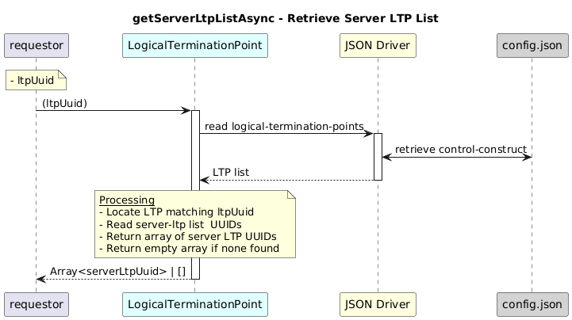

# GetServerLtpListAsync  

### Overview  

Retrieves the list of server Logical Termination Points for a given LTP.

### Description  

This function reads the LTP entry under:

core-model-1-4:control-construct
 └─ logical-termination-point
    └─ server-ltp

and returns all server LTP UUIDs associated with the provided LTP UUID.

If the LTP does not exist , an empty array is returned.

**Module:**  
applicationPattern/onfModel/models/LogicalTerminationPoint.js

### **Inputs**

| Name | Type | Description |
|------|------|-------------|
| ltpUuid | String | UUID of the LTP |

### **Output**

| Type | Description |
|------|-------------|
| Array | List of server LTP UUIDs  |
|undefined|Empty array if none found |

### Interface  

NA 

### Diagram  

  

 

### NPM Module  

[onf-core-model-ap](https://www.npmjs.com/package/onf-core-model-ap)  
