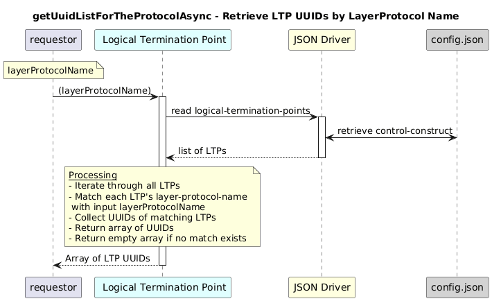

# getUuidListForTheProtocolAsync  

### Overview  

Returns the list of LTP UUIDs that contain a specific LayerProtocol type.

### Description  

core-model-1-4:control-construct/logical-termination-point holds all logical termination points (LTPs) 

This function scans all logical termination points under the control construct and returns the UUIDs of those whose layer-protocol-name matches the provided value.

It is useful for identifying all LTPs that implement a specific protocol layer (e.g., TCP client, HTTP server).

**Module:**  
applicationPattern/onfModel/models/LogicalTerminationPoint.js

### **Inputs**

### **Inputs**

| Name | Type | Description |
|------|------|-------------|
| layerProtocolName | String | One of `layerProtocolNameEnum`  as mentioned below|

        OPERATION_CLIENT: "operation-client-interface-1-0:LAYER_PROTOCOL_NAME_TYPE_OPERATION_LAYER",
        HTTP_CLIENT: "http-client-interface-1-0:LAYER_PROTOCOL_NAME_TYPE_HTTP_LAYER",
        TCP_CLIENT: "tcp-client-interface-1-0:LAYER_PROTOCOL_NAME_TYPE_TCP_LAYER",
        ES_CLIENT: "elasticsearch-client-interface-1-0:LAYER_PROTOCOL_NAME_TYPE_ELASTICSEARCH_LAYER",
        KAFKA_CLIENT: "kafka-client-interface-1-0:LAYER_PROTOCOL_NAME_TYPE_KAFKA_LAYER",
        MONGODB_CLIENT: "mongodb-client-interface-1-0:LAYER_PROTOCOL_NAME_TYPE_MONGODB_LAYER",
        OPERATION_SERVER: "operation-server-interface-1-0:LAYER_PROTOCOL_NAME_TYPE_OPERATION_LAYER",
        HTTP_SERVER: "http-server-interface-1-0:LAYER_PROTOCOL_NAME_TYPE_HTTP_LAYER",
        TCP_SERVER: "tcp-server-interface-1-0:LAYER_PROTOCOL_NAME_TYPE_TCP_LAYER"
    

### **Output**

| Type | Description |
|------|-------------|
| Array| List of LTP UUIDs matching the layer protocol |
|undefined | Empty array if none found|

### Interface  

NA 

### Diagram  

  

 

### NPM Module  

[onf-core-model-ap](https://www.npmjs.com/package/onf-core-model-ap)  
