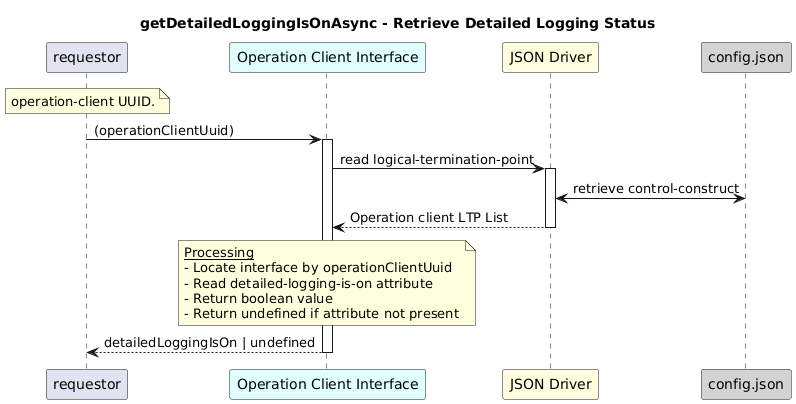

# getDetailedLoggingIsOnAsync  

### Overview  

Returns whether detailed logging mode is enabled for the operation-client.

### Description  

The configured detailed-logging-is-on is stored inside the operation-client
interface configuration under:

/core-model-1-4:control-construct
  /logical-termination-point
    /layer-protocol
      /operation-client-interface-1-0:operation-client-interface-pac
        /operation-client-interface-configuration
          /detailed-logging-is-on

This function returns the detailedLoggingIsOn attribute of the operation client.

**Module:**  
applicationPattern/onfModel/models/layerProtocols/OperationClientInterface.js

**Input:**  
| Name | Type | Description |
|------|--------|-------------|
| operationClientUuid | string | UUID of the operation-client  |

**Output:**  
| Type | Description |
|------|-------------|
| `boolean` | Status of detailed logging, else undefined|

### Interface  

NA 

### Diagram  

  

 

### NPM Module  

[onf-core-model-ap](https://www.npmjs.com/package/onf-core-model-ap)  
