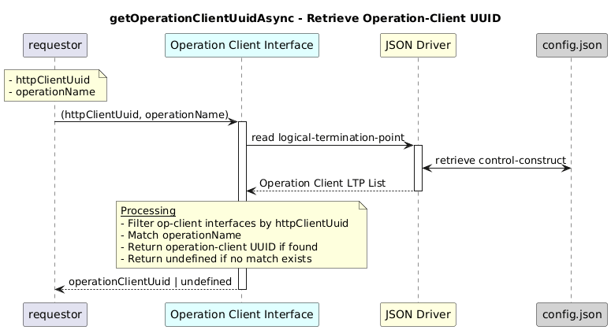

# GetOperationClientUuidAsync 

### Overview  

Retrieves the UUID of an operation-client under an HTTP client matching the given operation name.

### Description  

This function returns the operation client uuid information for the given **http-client uuid and operation name**.

**Module:**  
applicationPattern/onfModel/models/layerProtocols/OperationClientInterface.js

**Input:**  
| Name | Type | Description |
|------|--------|-------------|
| httpClientUuid | string | UUID of the http-client  |
|operationName|string |Operation name to find |

**Output:**  
| Type | Description |
|------|-------------|
| `string` | Operation-client UUID if found, else undefined|

### Interface  

NA 

### Diagram  

  

 

### NPM Module  

[onf-core-model-ap](https://www.npmjs.com/package/onf-core-model-ap)  
