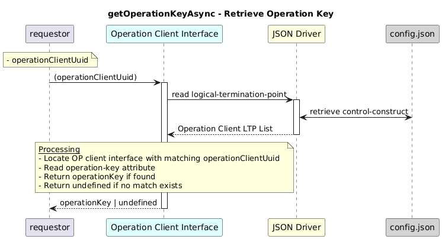

# GetOperationKeyAsync  

### Overview  

Retrieves the operation key configured for an operation-client.


### Description  

The operation key is stored inside:

```text
/core-model-1-4:control-construct
  /logical-termination-point
    /layer-protocol
      /operation-client-interface-1-0:operation-client-interface-pac
        /operation-client-interface-configuration
          /operation-key
```          

The function returns that value for the given UUID.

**Module:**  
applicationPattern/onfModel/models/layerProtocols/OperationClientInterface.js

**Input:**  
| Name | Type | Description |
|------|--------|-------------|
| operationClientUuid | string | UUID of the operation-client  |


**Output:**  
| Type | Description |
|------|-------------|
| `string` | Operation key, else undefined|


### Interface  

NA 

### Diagram  

<p align="center">
  
</p> 


### NPM Module  

[onf-core-model-ap](https://www.npmjs.com/package/onf-core-model-ap)  
