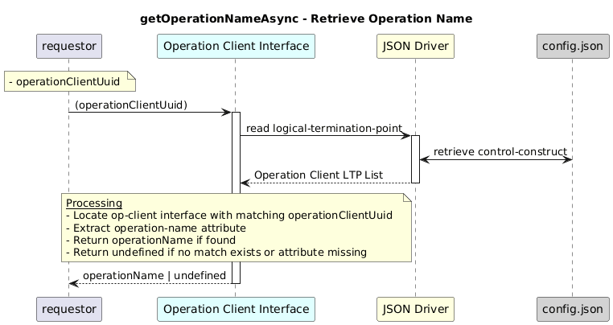

# GetOperationNameAsync  


### Overview  

Retrieves the operation name configured for the given Operation Client UUID.


### Description  

Each operation-client LTP contains a layer-protocol instance of type
operation-client-interface.

The configured operation name is stored inside the operation-client
interface configuration under:

```text
/core-model-1-4:control-construct
  /logical-termination-point
    /layer-protocol
      /operation-client-interface-1-0:operation-client-interface-pac
        /operation-client-interface-configuration
          /operation-name
```

This function reads the **operation-client** LTP identified by the provided UUID,
extracts the configured operation-name, and returns it.

If the operation name is not configured or the LTP does not exist,
the function returns undefined.

**Module:**  
applicationPattern/onfModel/models/layerProtocols/OperationClientInterface.js

**Input:**  
| Name | Type | Description |
|------|--------|-------------|
| operationClientUuid | string | UUID of the operation-client (-op-client-) |


**Output:**  
| Type | Description |
|------|-------------|
| `string` | Operation name, else undefined|


### Interface  

NA 


### Diagram  


<p align="center">
  
</p> 


### NPM Module  

[onf-core-model-ap](https://www.npmjs.com/package/onf-core-model-ap)  
