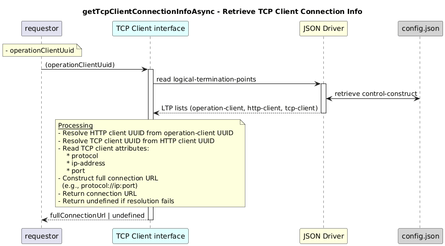

#  getTcpClientConnectionInfoAsync 

### Overview  

Retrieves the TCP connection endpoint (protocol, IP address, and port)
for the application hosting the given operation-client..

### Description  

An operation-client LTP is connected to an HTTP client LTP, which in turn
is connected to a TCP client LTP via server-LTP relationships.

This function resolves the connection chain as follows:

1 . Uses the provided operation-client UUID to retrieve its server LTP
(HTTP client UUID).

2 . Uses the HTTP client UUID to retrieve its server LTP
(TCP client UUID).

3 . Reads the TCP client configuration to obtain:

remote protocol

remote IP address

remote port

4 . Normalizes the remote address and constructs a full connection URL.

The returned value represents the network endpoint where the application
associated with the operation-client is running.

Then returns a full connection URL like:

http://10.0.0.1:8080
https://server.domain:443

**Module:**  
applicationPattern/onfModel/models/layerProtocols/OperationClientInterface.js

**Input:**  
| Name | Type | Description |
|------|--------|-------------|
| operationClientUuid | string | UUID of the operation-client  |

**Output:**  
| Type | Description |
|------|-------------|
| `string` | Full TCP connection URL|

### Interface  

NA 

### Diagram  

  

 

### NPM Module  

[onf-core-model-ap](https://www.npmjs.com/package/onf-core-model-ap)  
