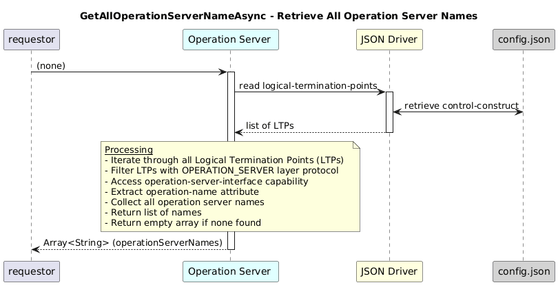

# GetAllOperationServerNameAsync

### Overview  

Retrieves **all operation server** names.

### Description  

This function Reads all Logical Termination Points with the **OPERATION_SERVER layer protocol** and returns the list of operation names from their capabilities.

**Module:**  
applicationPattern/onfModel/models/layerProtocols/OperationServerInterface.js

**Input:**  
| Name | Type | Description |
|------|--------|-------------|
| none|  |   |

**Output:**  
| Type | Description |
|------|-------------|
| `Array of String` | List of all operation server names.|

### Interface  

NA 

### Diagram  

  

 

### NPM Module  

[onf-core-model-ap](https://www.npmjs.com/package/onf-core-model-ap)  
