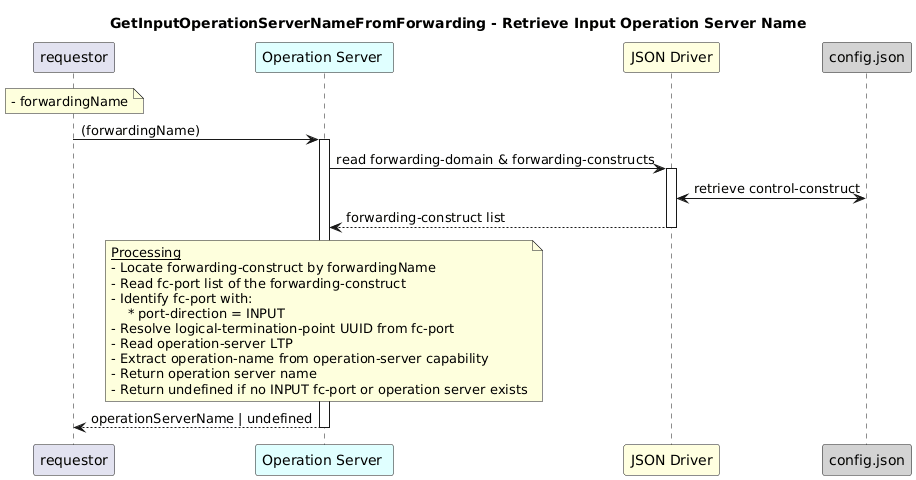

# GetInputOperationServerNameFromForwarding

### Overview  

Retrieves the operation server name for the input port of a forwarding construct.

### Description  

This function Fetches the forwarding construct by name, identifies the INPUT fc-port, and returns the associated operation server name.

**Module:**  
applicationPattern/onfModel/models/layerProtocols/OperationServerInterface.js

**Input:**  
| Name | Type | Description |
|------|--------|-------------|
| forwardingName| string | Name of the forwarding. |

**Output:**  
| Type | Description |
|------|-------------|
| `string/undefined` | Operation server name, or undefined if not found.|

### Interface  

NA 

### Diagram  

  

 

### NPM Module  

[onf-core-model-ap](https://www.npmjs.com/package/onf-core-model-ap)  
