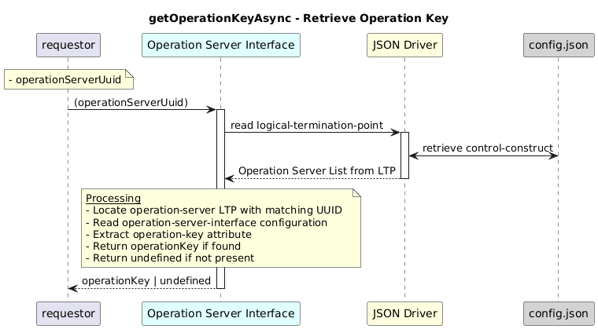

# GetOperationKeyAsync


### Overview  

 Retrieves the operation key for a given **operation server UUID**.


### Description  

```text
/core-model-1-4:control-construct
  /logical-termination-point
    /layer-protocol
      /operation-server-interface/
```       

This function Returns the configured operation key from the **operation-server-interface configuration** of the specified operation server.

**Module:**  
applicationPattern/onfModel/models/layerProtocols/OperationServerInterface.js

**Input:**  
| Name | Type | Description |
|------|--------|-------------|
| operationServerUuid| string | UUID of the operation server  |


**Output:**  
| Type | Description |
|------|-------------|
| `String` | Operation key, or undefined if not found.|


### Interface  

NA 


### Diagram  

<p align="center">
  
</p> 


### NPM Module  

[onf-core-model-ap](https://www.npmjs.com/package/onf-core-model-ap)  
