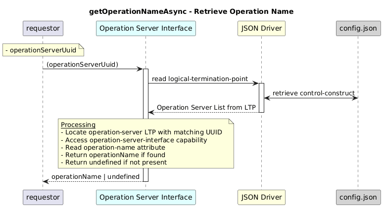

# GetOperationNameAsync


### Overview  

Retrieves the **operation name** for a given operation server UUID.


### Description  

The Logical Termination Point is read from the following path:

```text
/core-model-1-4:control-construct
  /logical-termination-point
    /layer-protocol
      /operation-server-interface/
```          

This function Fetches the Logical Termination Point (LTP) for the specified UUID and returns the configured operation name from the **operation-server-interface capability**.


**Module:**  
applicationPattern/onfModel/models/layerProtocols/OperationServerInterface.js

**Input:**  
| Name | Type | Description |
|------|--------|-------------|
| operationServerUuid| string | UUID of the operation server  |


**Output:**  
| Type | Description |
|------|-------------|
| `string` | Operation name, or undefined if not found.|


### Interface  

NA 


### Diagram  

<p align="center">
  
</p> 


### NPM Module  

[onf-core-model-ap](https://www.npmjs.com/package/onf-core-model-ap)  
