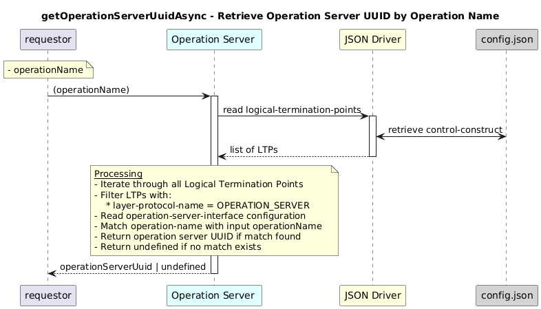

# getOperationServerUuidAsync


### Overview  

Retrieves the **UUID of an operation server** given its operation name.


### Description  

The Logical Termination Point is read from the following path:

```text
/core-model-1-4:control-construct
  /logical-termination-point
      /layer-protocol-name
```          

This function Searches all Logical Termination Points with the **OPERATION_SERVER layer protocol** and returns the UUID matching the provided operation name.


**Module:**  
applicationPattern/onfModel/models/layerProtocols/OperationServerInterface.js

**Input:**  
| Name | Type | Description |
|------|--------|-------------|
| operationName| string | Name of the operation server. |


**Output:**  
| Type | Description |
|------|-------------|
| `string` | UUID of the operation server, or undefined if not found.|


### Interface  

NA 


### Diagram  

<p align="center">
  
</p> 


### NPM Module  

[onf-core-model-ap](https://www.npmjs.com/package/onf-core-model-ap)  
