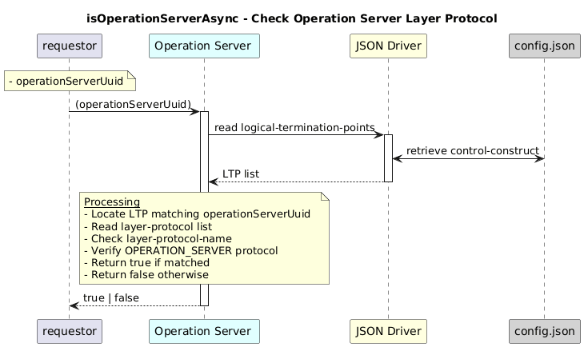

# isOperationServerAsync

### Overview  

Checks whether a given UUID belongs to an **operation-server** layer protocol.

### Description  

This function verifies if the provided UUID represents a **Logical Termination Point (LTP)**
configured with the **OPERATION_SERVER** layer protocol.

**Module:**  
applicationPattern/onfModel/models/layerProtocols/OperationServerInterface.js

**Input:**  
| Name | Type | Description |
|------|--------|-------------|
| operationServerUuid| string | UUID of the operation server  |

**Output:**  
| Type | Description |
|------|-------------|
| `boolean` | true if UUID belongs to an operation-server, otherwise false|

### Interface  

NA 

### Diagram  

  

 

### NPM Module  

[onf-core-model-ap](https://www.npmjs.com/package/onf-core-model-ap)  
