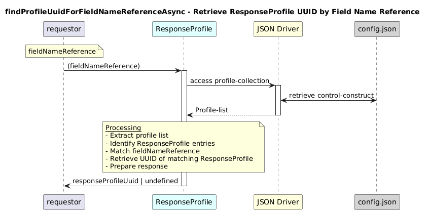

# findProfileUuidForFieldNameReferenceAsync  

### Overview  

Finds the ResponseProfile UUID associated with a given field-name reference.

### Description  
core-model-1-4:control-construct/profile-collection holds all the profiles. To find the UUID of a ResponseProfile that corresponds to a given fieldNameReference, this function shall be used. It searches all profiles of the ResponseProfile type and returns the UUID of the matching profile if found.

**Module:**  
applicationPattern/onfModel/models/profile/ResponseProfile.js

### **Inputs**
| Name | Type | Description |
|------|------|-------------|
| fieldNameReference | String | The ONF path or field-name reference |

### **Output**
| Type | Description |
|------|-------------|
| String | Matching ResponseProfile UUID |
|  undefined | If no matching profile exists |

### Interface  

NA 

### Diagram  

  

 

### NPM Module  

[onf-core-model-ap](https://www.npmjs.com/package/onf-core-model-ap)  
