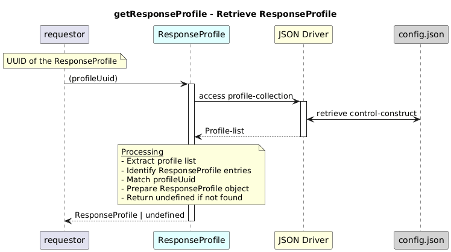

# getResponseProfile  

### Overview  

Retrieves the complete ResponseProfile configuration and capability for a given profile UUID.

### Description  
core-model-1-4:control-construct/profile-collection holds all the profiles. To retrieve the full ResponseProfile object for a given profileUuid that belongs to a particular profileNameType, this function shall be used. It returns the complete capability and configuration, including operationName, fieldName, description, datatype, and value.

**Module:**  
applicationPattern/onfModel/models/profile/ResponseProfile.js

### **Inputs**
| Name | Type | Description |
|------|------|-------------|
| profileUuid | String | UUID of the ResponseProfile |

### **Output**
| Type | Description |
|------|-------------|
| ResponseProfile | ResponseProfile object if found |
|  undefined | If no matching profile exists |

### Interface  

NA 

### Diagram  

  

 

### NPM Module  

[onf-core-model-ap](https://www.npmjs.com/package/onf-core-model-ap)  
