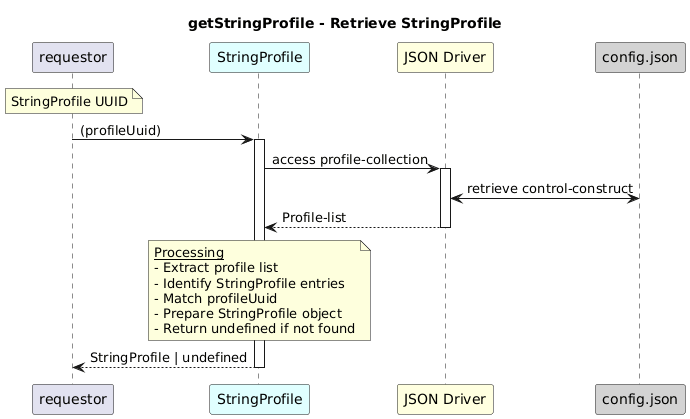

# GetProfileListForProfileNameAsync  

### Overview  

Retrieves the complete StringProfile configuration and capability for a given profile UUID.

### Description  
core-model-1-4:control-construct/profile-collection holds all the profiles. To retrieve the **Complete StringProfile object**  this function shall be used.

 It returns the complete capability and configuration, including stringName, enumeration, pattern, and stringValue.

If no matching profile exists, the function returns undefined.

**Module:**  
applicationPattern/onfModel/models/profile/StringProfile.js

### **Inputs**
| Name | Type | Description |
|------|------|-------------|
| profileUuid | String |UUID of the StringProfile |

### **Output**
| Type | Description |
|------|-------------|
| StringProfile | StringProfile object if found |
|  undefined | If no matching profile exists |

### Interface  

NA 

### Diagram  

  

 

### NPM Module  

[onf-core-model-ap](https://www.npmjs.com/package/onf-core-model-ap)  
