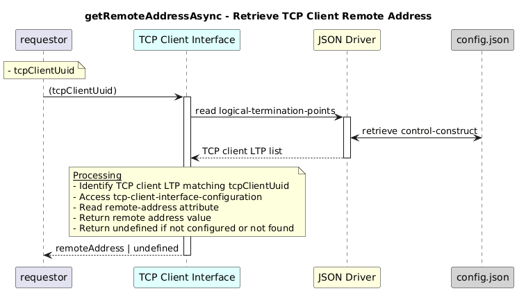

# getRemoteAddressAsync  

### Overview  

This  returns the tcp ip address where the application is running .

### Description  

Each TCP client LTP stores its address in tcp-client-interface-configuration/remote-address.

This function reads and returns that value for the provided TCP client UUID.

**Module:**  
applicationPattern/onfModel/models/layerProtocols/TcpClientInterface.js

### **Inputs**
| Name | Type | Description |
|------|------|-------------|
| tcpClientUuid | String | UUID of the TCP client interface (*-tcp-client-*) |

### **Output**
| Type | Description |
|------|-------------|
| String| Remote address value, or undefined if not configured |

### Interface  

NA 

### Diagram  

  

 

### NPM Module  

[onf-core-model-ap](https://www.npmjs.com/package/onf-core-model-ap)  
