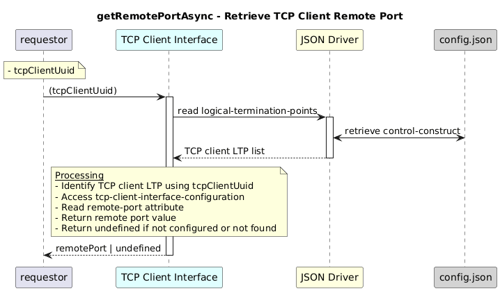

# GetRemotePortAsync  

### Overview  

Retrieves the tcp port where the application is running .

### Description  

 remote port number  is stored  under  core-model-1-4:control-construct/logical-termination-point/tcp-client-interface-1-0:tcp-client-interface-pac/tcp-client-interface-configuration/remote-port.

This function reads the **remote port number** on which the external application is listening, based on the provided TCP client UUID.

**Module:**  
applicationPattern/onfModel/models/layerProtocols/TcpClientInterface.js

### **Inputs**
| Name | Type | Description |
|------|------|-------------|
| tcpClientUuid | String | UUID of the TCP client |

### **Output**
| Type | Description |
|------|-------------|
| String| Remote port value, or undefined if not configured |

### Interface  

NA 

### Diagram  

  

 

### NPM Module  

[onf-core-model-ap](https://www.npmjs.com/package/onf-core-model-ap)  
