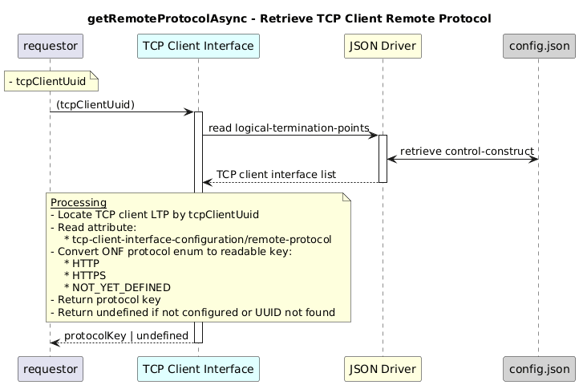

# GetRemoteProtocolAsync  

### Overview  

Retrieves the the tcp protocol where the application is running .

### Description  

The protocol is read from  core-model-1-4:control-construct/logical-termination-point/tcp-client-interface-1-0:tcp-client-interface-pac/tcp-client-interface-configuration/remote-protocol

The TCP client interface stores the **protocol** as an ONF enum value.
This function converts that enum into a readable protocol key and returns it.

**Module:**  
applicationPattern/onfModel/models/layerProtocols/TcpClientInterface.js

### **Inputs**
| Name | Type | Description |
|------|------|-------------|
| tcpClientUuid | String | UUID of the TCP client interface |

### **Output**
| Type | Description |
|------|-------------|
| String | Protocol key: `"HTTP"`, `"HTTPS"`, `"NOT_YET_DEFINED"` |

            

### Interface  

NA 

### Diagram  

  

 

### NPM Module  

[onf-core-model-ap](https://www.npmjs.com/package/onf-core-model-ap)  
