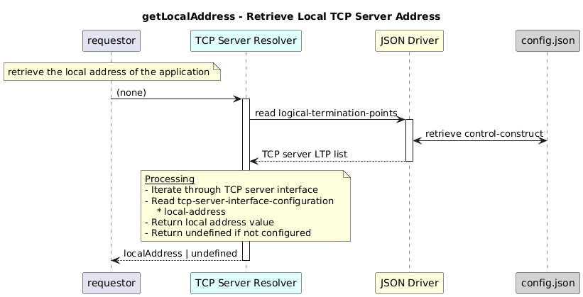

# getLocalAddress  

### Overview  

Retrieves the local address of the first available TCP server interface.

### Description  

This function reads the local address (IPv4 address or domain name) configured for the current application 

Reads local-address or local-port from the first TCP server LTP under core-model-1-4:control-construct/logical-termination-point

**Module:**  
applicationPattern/onfModel/models/layerProtocols/HttpClientInterface.js

### **Inputs**
None

### **Output**
| Type | Description |
|------|-------------|
| String | Local address (IP) |

### Interface  

NA 

### Diagram  

  

 

### NPM Module  

[onf-core-model-ap](https://www.npmjs.com/package/onf-core-model-ap)  
