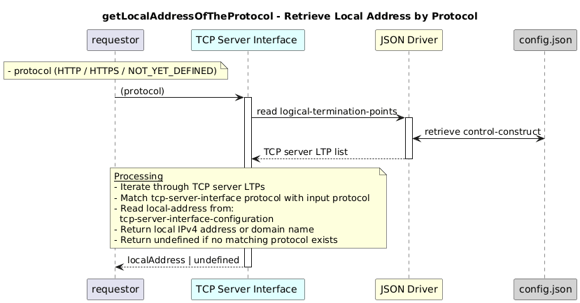

# getLocalAddressOfTheProtocol  

### Overview  

Retrieves the local address (IP or domain name) of the TCP server for the given protocol.

### Description  

This function returns the IPv4 address or domain name of the current application.

The address is read from
core-model-1-4:control-construct/logical-termination-point/tcp-server-interface-configuration/local-address
for the TCP server interface matching the given protocol.

If no matching TCP server exists, undefined is returned.

**Module:**  
applicationPattern/onfModel/models/layerProtocols/HttpClientInterface.js

### **Inputs**
| Name | Type | Description |
|------|------|-------------|
| protocol | String | Protocol enum value shall be one of the following value as mentioned below  |

 HTTP: "tcp-server-interface-1-0:PROTOCOL_TYPE_HTTP",
 HTTPS: "tcp-server-interface-1-0:PROTOCOL_TYPE_HTTPS",
 NOT_YET_DEFINED: "tcp-server-interface-1-0:PROTOCOL_TYPE_NOT_YET_DEFINED"

### **Output**
| Type | Description |
|------|-------------|
| String | Local IPv4 address or domain name |

### Interface  

NA 

### Diagram  

  

 

### NPM Module  

[onf-core-model-ap](https://www.npmjs.com/package/onf-core-model-ap)  
