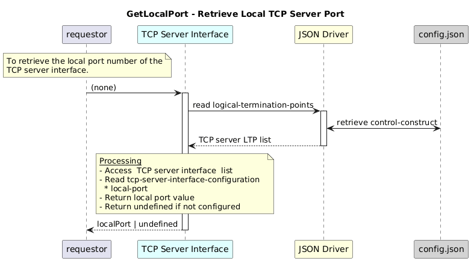

# GetLocalPort  

### Overview  

Retrieves the local port number of the first available TCP server interface

### Description  

This function reads and returns the port number configured for the first TCP server instance under the Logical Termination Point.

**Module:**  
applicationPattern/onfModel/models/layerProtocols/HttpClientInterface.js

### **Inputs**
NONE

### **Output**

| Type | Description |
|------|-------------|
| String| Local port number |

### Interface  

NA 

### Diagram  

  

 

### NPM Module  

[onf-core-model-ap](https://www.npmjs.com/package/onf-core-model-ap)  
