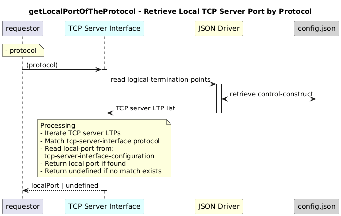

# getLocalPortOfTheProtocol

### Overview  

Retrieves the local port number of the TCP server for the given protocol.

### Description  

The port is read from tcp-server-interface-configuration/local-port of the TCP server LTP that matches the input protocol.

**Module:**  
applicationPattern/onfModel/models/layerProtocols/HttpClientInterface.js

### **Inputs**
| Name | Type | Description |
|------|------|-------------|
| protocol | String | Protocol enum value  shall be one of the following value as mentioned below  |

 HTTP: "tcp-server-interface-1-0:PROTOCOL_TYPE_HTTP",
 HTTPS: "tcp-server-interface-1-0:PROTOCOL_TYPE_HTTPS",
 NOT_YET_DEFINED: "tcp-server-interface-1-0:PROTOCOL_TYPE_NOT_YET_DEFINED"

### **Output**
| Type | Description |
|------|-------------|
| String | Local port number |

### Interface  

NA 

### Diagram  

  

 

### NPM Module  

[onf-core-model-ap](https://www.npmjs.com/package/onf-core-model-ap)  
