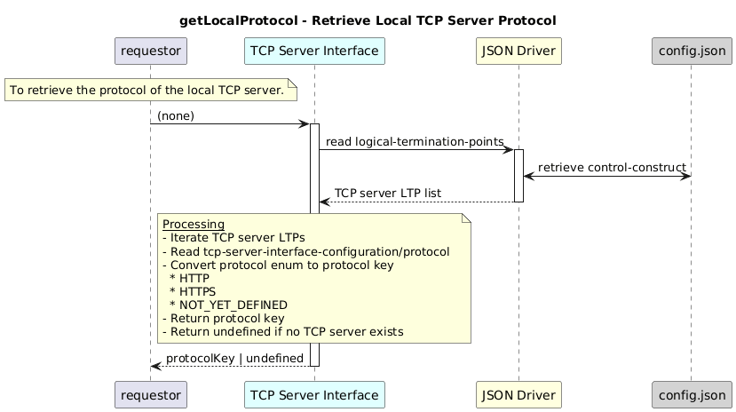

# GetLocalProtocol  

### Overview  

Retrieves the protocol of the first available TCP server interface.

### Description  

This function returns the protocol of the current application.

The port is read from tcp-server-interface-configuration/local-port of the TCP server LTP that matches the input protocol.

**Module:**  
applicationPattern/onfModel/models/layerProtocols/HttpClientInterface.js

### **Inputs**
NONE

### **Output**
| Type | Description |
|------|-------------|
| String| Protocol key (`HTTP`, `HTTPS`, `NOT_YET_DEFINED`) as mention below |

 HTTP: "tcp-server-interface-1-0:PROTOCOL_TYPE_HTTP",
 HTTPS: "tcp-server-interface-1-0:PROTOCOL_TYPE_HTTPS",
 NOT_YET_DEFINED: "tcp-server-interface-1-0:PROTOCOL_TYPE_NOT_YET_DEFINED"

### Interface  

NA 

### Diagram  

  

 

### NPM Module  

[onf-core-model-ap](https://www.npmjs.com/package/onf-core-model-ap)  
