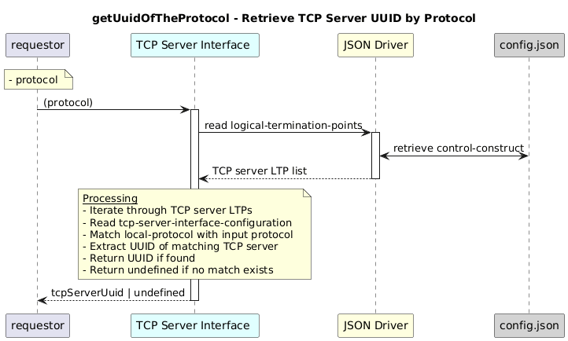

# getUuidOfTheProtocol  

### Overview  

Retrieves the UUID of the TCP server interface for the given protocol.

### Description  

TCP server interfaces are stored as Logical Termination Points (LTPs) under the control-construct.
Each TCP server LTP contains protocol configuration information such as the local protocol, IP address, and port.

This function scans all TCP server LTPs and returns the UUID of the TCP server whose configured protocol matches the given input protocol.

If no matching TCP server is found, the function returns undefined.

**Module:**  
applicationPattern/onfModel/models/layerProtocols/HttpClientInterface.js

### **Inputs**
| Name | Type | Description |
|------|------|-------------|
| protocol | String | Protocol enum value shall be one of the following value as mentioned below   |

  HTTP: "tcp-server-interface-1-0:PROTOCOL_TYPE_HTTP",
  HTTPS: "tcp-server-interface-1-0:PROTOCOL_TYPE_HTTPS",
  NOT_YET_DEFINED: "tcp-server-interface-1-0:PROTOCOL_TYPE_NOT_YET_DEFINED"

### **Output**
| Type | Description |
|------|-------------|
| String | UUID of the matching TCP server interface |

### Interface  

NA 

### Diagram  

  

 

### NPM Module  

[onf-core-model-ap](https://www.npmjs.com/package/onf-core-model-ap)  
