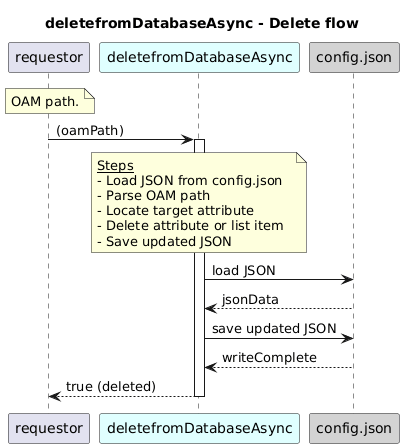

# deletefromDatabaseAsync  

### Overview  

Deletes a value or list entry from the  JSON configuration file (config.json).

### Description  

This function reads the provided oamPath and navigates through the config.json file to find the target data.

Depending on the path, it:

1.Removes a specific attribute from an object, or

2.Deletes a matching entry from a list using its primary key.

3.After the deletion, the updated configuration is saved back to the JSON file.

If the given path is invalid or the target data does not exist, an appropriate HTTP error is thrown.

**Module:**  
applicationPattern/databaseDriver/JSONDriver.js

**Input:**  
Function inputs are:

 ###  Inputs

| Parameter | Type | Description |
|----------|-------|-------------|
| `oamPath` | string | JSON path identifying the attribute to delete |

**Output:**  

| Type | Description |
|------|-------------|
| `boolean` | true if deletion succeeds |

### Interface  

NA 

### Diagram  

  

### NPM Module  

[onf-core-model-ap](https://www.npmjs.com/package/onf-core-model-ap)  
