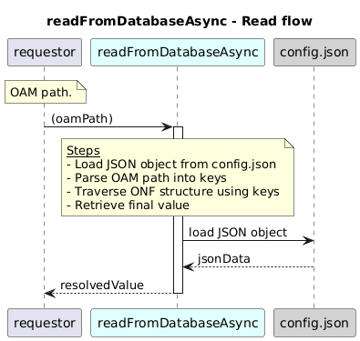

# readFromDatabaseAsync  

### Overview  

Reads a value from the ONF JSON configuration file (config.json) using an OAM-style path.

### Description  

This function uses the given oamPath starting from
core-model-1-4:control-construct and walks through the JSON configuration structure.

It moves through nested objects and list entries, resolving list items using their primary keys when needed.

If the value exists, it is returned.
If the path is invalid or the value is not found, the function throws an HTTP NOT_FOUND error.

**Module:**  
applicationPattern/databaseDriver/JSONDriver.js

**Input:**  
Function inputs are:

| Parameter | Type | Description |
|----------|-------|-------------|
| `oamPath` | string | JSON path pointing to the required attribute |

**Output:**  

| Type | Description |
|------|-------------|
| `Object` | The located value, otherwise throws NOT_FOUND error |

### Interface  

NA 

### Diagram  

  

### NPM Module  

[onf-core-model-ap](https://www.npmjs.com/package/onf-core-model-ap)  
