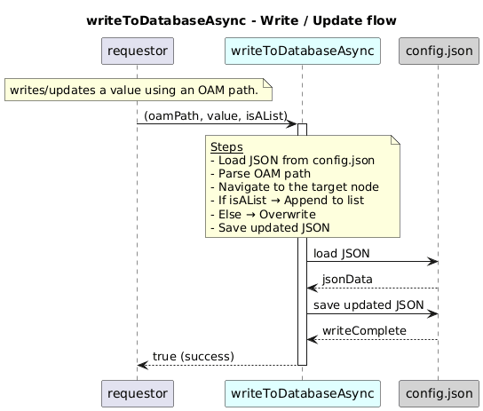

# writeToDatabaseAsync  

### Overview  

Writes or updates values in the JSON ONF-format database (config.json) at the specified OAM path.

### Description  

This function locates the correct position inside the JSON database by splitting and navigating the given oamPath.
Depending on the input:

It updates an existing attribute,

or adds a new item when the target is a list (isAList = true).

After modification, the updated JSON structure is written back to the file safely using concurrency-controlled operations.

**Module:**  
applicationPattern/databaseDriver/JSONDriver.js

**Input:**  
Function inputs are:

###  Inputs

| Parameter | Type | Description |
|----------|-------|-------------|
| `oamPath` | string | JSON path where the value will be written |
| `valueToBeUpdated` | JSON / string | New value to insert or update |
| `isAList` | boolean | Whether the target is list-type and should append |

**Output:**  

| Type | Description |
|------|-------------|
| `boolean` | true if update succeeds, else false |

### Interface  

NA 

### Diagram  

  

### NPM Module  

[onf-core-model-ap](https://www.npmjs.com/package/onf-core-model-ap)  
