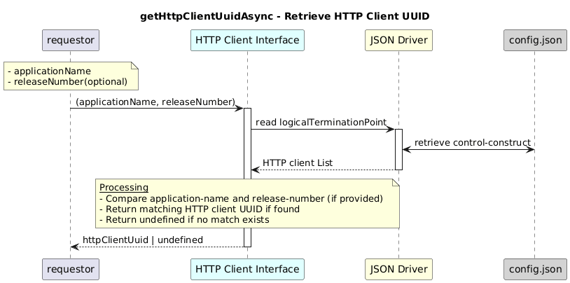

# getHttpClientUuidAsync  

### Overview  

Finds the HTTP client UUID that matches the specified application name and optional release number.

### Description  

This function identifies the HTTP client UUID that matches the given application name and an optional release number.

It iterates through all Logical Termination Points containing a
http-client-interface-1-0:http-client-interface-pac, and compares the configured:

application-name

release-number (if provided)

against the input parameters.

If a matching HTTP client interface is found, the corresponding HTTP client UUID is returned.
If no match exists, the function returns undefined.

**Module:**  
applicationPattern/onfModel/models/layerProtocols/HttpClientInterface.js

**Input:**  
Function inputs are:
### **Inputs**
| Name | Type | Description |
|------|--------|-------------|
| applicationName | string | Name of the HTTP client application |
| releaseNumber | string (optional) | Release number of the application |

**Output:**  
| Type | Description |
|------|-------------|
| `string` |  HTTP client UUID if found; otherwise **undefined**. |

### Interface  

NA 

### Diagram  

  

 

### NPM Module  

[onf-core-model-ap](https://www.npmjs.com/package/onf-core-model-ap)  
