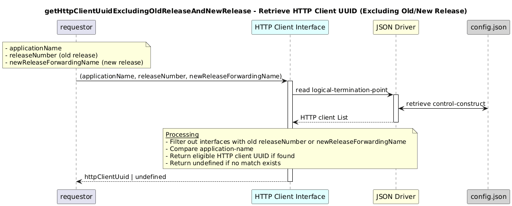

# getHttpClientUuidExcludingOldReleaseAndNewRelease  

### Overview  

Retrieves the HTTP client UUID for a given application name while excluding both
the current old release and the incoming new release associated with a specific forwarding construct.

Return the HTTP client UUID for an application while ignoring both its old release and newly deployed release.

### Description  

This function retrieves an HTTP client UUID for the specified application name while explicitly excluding:

the old release, identified by the provided releaseNumber, and

the new release, identified via the forwarding construct name newReleaseForwardingName.

In environments where multiple versions of the same application coexist (for example during rolling upgrades), this function ensures that neither the currently deployed old version nor the newly introduced version is selected.

The function scans all HTTP client layer-protocol instances, evaluates their configured application-name and release-number, and filters out HTTP client interfaces associated with:

the specified releaseNumber, and

the forwarding construct representing the new release.

If another valid HTTP client interface for the application exists, its UUID is returned.
If no eligible match is found, the function returns undefined.

**Module:**  
applicationPattern/onfModel/models/layerProtocols/HttpClientInterface.js

**Input:**  
Function inputs are:
### **Inputs**
| Name | Type | Description |
|------|--------|-------------|
| applicationName | string | Name of the application |
| releaseNumber | string (optional) | Release number |
| newReleaseForwardingName | string | Forwarding name of the new release to exclude |

**Output:**  
| Type | Description |
|------|-------------|
| `string` |  A matching HTTP client UUID, excluding old and new releases |

### Interface  

NA 

### Diagram  

  

 

### NPM Module  

[onf-core-model-ap](https://www.npmjs.com/package/onf-core-model-ap)  
