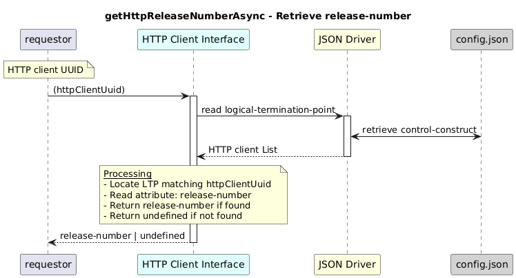

# GetReleaseNumberAsync  

### Overview  

Retrieves the release number of an HTTP client application.

### Description  

This function retrieves the  release-number configured for a specific HTTP client interface.

It locates the HTTP client Logical Termination Point (LTP) using the provided httpClientUuid, then accesses the
**http-client-interface-1-0:http-client-interface-pac/http-client-interface-configuration/release-number attribute.**

If the HTTP client interface or the application name attribute is not present, the function returns undefined.

**Module:**  
applicationPattern/onfModel/models/layerProtocols/HttpClientInterface.js

**Input:**  
Function inputs are:
| Parameter | Type | Description |
|----------|-------|-------------|
| `httpClientUuid` | string | UUID of the HTTP client interface (...-http-client-<digits>)|

**Output:**  
| Type | Description |
|------|-------------|
| `string` | Release number if present, else undefined |

### Interface  

NA 

### Diagram  

  

 

### NPM Module  

[onf-core-model-ap](https://www.npmjs.com/package/onf-core-model-ap)  
