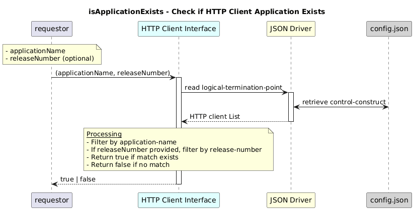

# isApplicationExists  

### Overview  

Checks whether an HTTP client with the given application details exists.

### Description  

This function returns the uuid of the http-client-interface for the application-name and release-number.If release number  is not provided , then only the application name will be checked

**Module:**  
applicationPattern/onfModel/models/layerProtocols/HttpClientInterface.js

**Input:**  
Function inputs are:
### **Inputs**
| Name | Type | Description |
|------|--------|-------------|
| applicationName | string | Application name |
| releaseNumber | string (optional) | Release number |

**Output:**  
| Type | Description |
|------|-------------|
| `boolean` |  True if the application exists, else false|

### Interface  

NA 

### Diagram  

  

 

### NPM Module  

[onf-core-model-ap](https://www.npmjs.com/package/onf-core-model-ap)  
