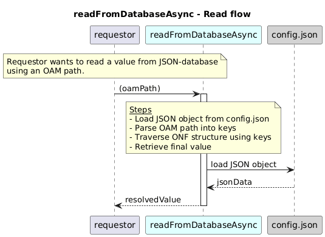

# p1ReadFromConfigFile

### Overview  

The function p1ReadFromConfigFile reads a value from the JSON database using an OAM-style path.  

**Input:**  
Function inputs are:
| Parameter | Type | Description |
|----------|-------|-------------|
| `oamPath` | string | JSON path pointing to the required attribute |

**Output:**  
| Type | Description |
|------|-------------|
| `Promise<any>` | The located value, otherwise throws NOT_FOUND error |

### Diagram  

  

### Interface  

NA 

### NPM Module  

[onf-core-model-ap](https://www.npmjs.com/package/onf-core-model-ap)  

