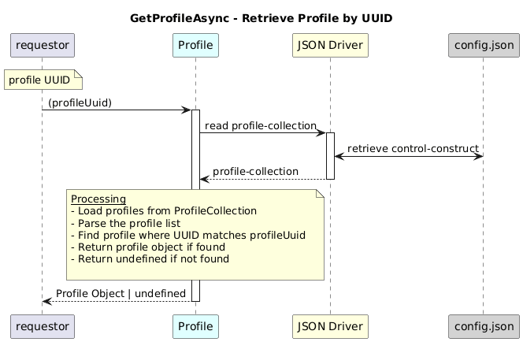

# GetProfileAsync  

### Overview  

Returns a profile instance matching the given UUID.

### Description  

This function returns a profile instance from /core-model-1-4:control-construct/profile-collection/profile list 
 that matches the profileUuid.

**Module:**  
applicationPattern/onfModel/models/ProfileCollection.js

### **Inputs**

| Name | Type | Description |
|------|------|-------------|
| profileUuid | String | UUID in the pattern` |

### **Output**

| Type | Description |
|------|-------------|
| Object| Profile object |
|  undefined|  undefined if no object  found |

### Interface  

NA 

### Diagram  

  

 

### NPM Module  

[onf-core-model-ap](https://www.npmjs.com/package/onf-core-model-ap)  
