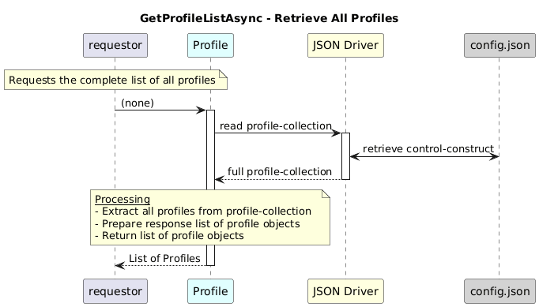

#  GetProfileListAsync

### Overview  

Retrieves the complete list of profiles available in the profile collection.

### Description  

Profiles are stored under
core-model-1-4:control-construct/profile-collection/profile.

This function reads the profile-collection from the config.json and returns all profiles without any filtering.

It is commonly used as a base function by profile-specific modules such as ActionProfile, FileProfile, IntegerProfile, StringProfile, and ResponseProfile.

**Module:**  
applicationPattern/onfModel/models/ProfileCollection.js

**Input:**  
Function inputs are:

| Parameter | Type | Description |
|----------|-------|-------------|
| none | - |- |

**Output:**  
| Type | Description |
|------|-------------|
| `Object` |  List of all profile objects  |

### Interface  

NA 

### Diagram  

  

 

### NPM Module  

[onf-core-model-ap](https://www.npmjs.com/package/onf-core-model-ap)  
