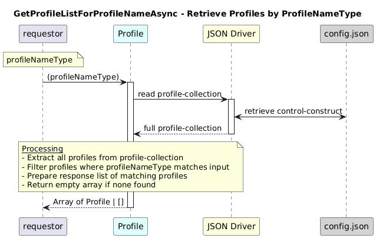

# GetProfileListForProfileNameAsync  

### Overview  

Retrieves profiles that match the given profileNameType.

### Description  

core-model-1-4:control-construct/profile-collection holds all the profile. To retrieve the list of profiles belong to a particular **profileNameType** , this function shall be used.

**Module:**  
applicationPattern/onfModel/models/ProfileCollection.js

**Input:**  
Function inputs are:
| Parameter | Type | Description |
|----------|-------|-------------|
| `profileNameType` | string | profileNameTYpe shall be one of the following value as mentioned below |

- ACTION_PROFILE: "action-profile-1-0:PROFILE_NAME_TYPE_ACTION_PROFILE",
- FILE_PROFILE: "file-profile-1-0:PROFILE_NAME_TYPE_FILE_PROFILE",
- INTEGER_PROFILE: "integer-profile-1-0:PROFILE_NAME_TYPE_INTEGER_PROFILE",
- OAM_RECORD_PROFILE: "oam-record-profile-1-0:PROFILE_NAME_TYPE_OAM_RECORD_PROFILE",
- RESPONSE_PROFILE: "response-profile-1-0:PROFILE_NAME_TYPE_GENERIC_RESPONSE_PROFILE",
- SERVICE_RECORD_PROFILE: "service-record-profile-1-0:PROFILE_NAME_TYPE_SERVICE_RECORD_PROFILE",
- STRING_PROFILE: "string-profile-1-0:PROFILE_NAME_TYPE_STRING_PROFILE" 

**Output:**  
| Type | Description |
|------|-------------|
| `Array` | List of matching profile instances or an empty array |

### Interface  

NA 

### Diagram  

  

 

### NPM Module  

[onf-core-model-ap](https://www.npmjs.com/package/onf-core-model-ap)  
