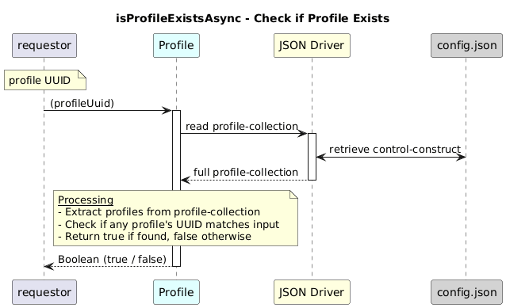

# isProfileExistsAsync  

### Overview  

Checks whether a profile exists for the provided UUID.

### Description  

This function returns true if a profile instance exists in /core-model-1-4:control-construct/profile-collection/profile  list that matches the profileUuid.

**Module:**  
applicationPattern/onfModel/models/ProfileCollection.js

**Input:**  
Function inputs are:
| Parameter | Type | Description |
|----------|-------|-------------|
| `profileUuid` | string | Profile UUID  |

**Output:**  
| Type | Description |
|------|-------------|
| `Boolean` |  true if profile exists, false otherwise |

### Interface  

NA 

### Diagram  

  

 

### NPM Module  

[onf-core-model-ap](https://www.npmjs.com/package/onf-core-model-ap)  
