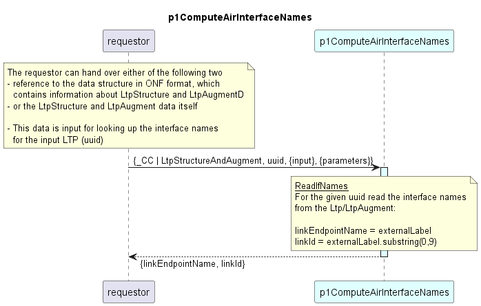

# p1ComputeAirInterfaceNames

### Overview  

The function p1ComputeAirInterfaceNames looks up AirInterface names (linkEndpointId, linkId) in LtpStructureAndAugment information.  

*Input:*  
Function inputs are:
- either a reference to the data structure storing Ltps and LtpAugment information in ONF format
- or the Ltp and LtpAugment information directly (the format is the same as for the reference option)
- the uuid for which the lookup shall be executed (it is not verified here, that the LTP is actually an AirInterface, this check has to be carried out on caller side)
- optional input and function parameters (currently unused)  

*Output:*  
The function reads the list of LTPs from the input until it finds the input uuid.  
It retrieves the interface names from the LtpAugment (external-label) belonging to this LTP and returns the following data:
- linkEndpointId = linkId + [AB]
- linkId

### Diagram  

  

### Interface  

Please find a detailed description of the [interface](./interface.yaml).  

### NPM Module  

[mw-sdn-p1ComputeAirInterfaceNames](https://www.npmjs.com/package/mw-sdn-p1ComputeAirInterfaceNames)  

