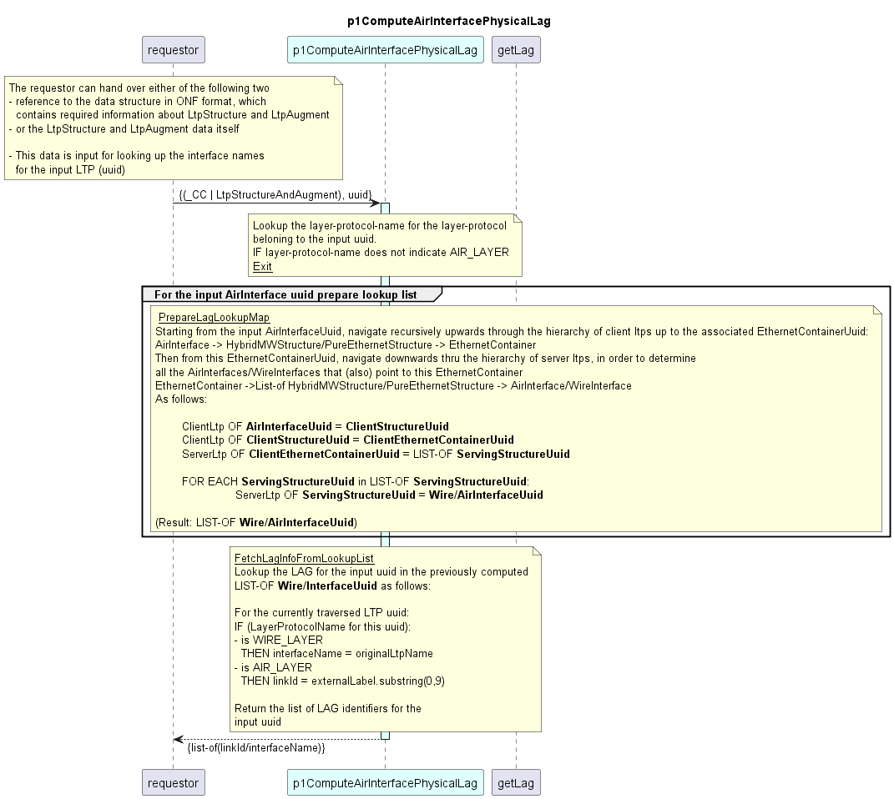

# p1ComputeAirInterfacePhysicalLag  

### Overview  

The function p1ComputeAirInterfacePhysicalLag looks up Physical Linkaggregation (LAG) information in LtpStructureAndAugment information for a given AirInterface uuid.  

**Input:**  
Function inputs are:
- either a reference to the data structure storing Ltps and LtpAugment information in ONF format
- or the Ltp and LtpAugment information directly (the format is the same as for the reference option)
- the uuid for which the lookup shall be executed (if this is not an AirInterface LAG information will not be compiled)

**Output:**  
From the LTP structure and augment the function compiles a lookup list of WireInterface and AirInterface uuids related to the input uuid.  
This list is then traversed to retrieve the LAG information. For every uuid in the lookup list, which belongs to
- a WireInterface: compute an interfaceName (from the augments original-ltp-name)
- an AirInterface: compute a linkId (from the augments external-label)

The returned result is a list of linkIds or interfaceNames.

### Diagram  

  

### Interface  

Please find a detailed description of the [interface](./interface.yaml).  

### NPM Module  

[mw-sdn-p1ComputeAirInterfacePhysicalLag](https://www.npmjs.com/package/mw-sdn-p1ComputeAirInterfacePhysicalLag)  

