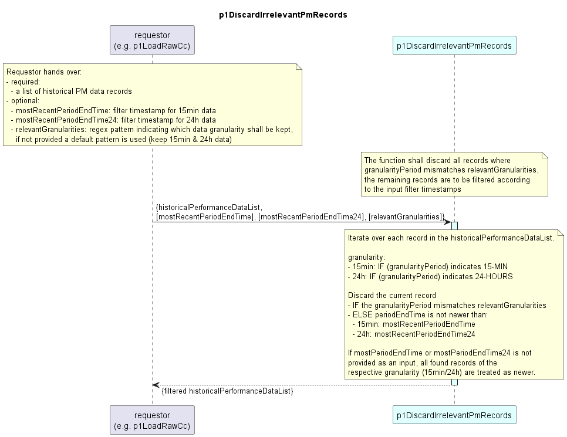

# p1DiscardIrrelevantPmRecords

### Overview  

The p1DiscardIrrelevantPmRecords function receives a list of historical performance data records as input.  
It iterates over this list and discards all irrelevant records. The list with the remaining records is returned as output.
Records are considered irrelevant, if:
- their granularityPeriod does not match the pattern in *relevantGranularities* (if this optional parameter is not provided, a default pattern is to be applied, which filters for 15min and 24h data),
- or if their periodEndTime is not newer than the filter timestamp

**Inputs:**  
Required inputs are:
- *historicalPmDataList*: contains the records to be filtered

Optional inputs are:
- *mostRecentPeriodEndTime*: if 15min records are denoted as relevant, they shall be filtered using this timestamp
- *mostRecentPeriodEndTime24*: if 24min records are denoted as relevant, they shall be filtered using this timestamp
- *relevantGranularities*: indicates for which granularities data shall be kept, default is 15min and 24h

**Processing:**  
The function iterates over all records in the historicalPmDataList and discards them, if:
- the are irrelevant according to *relevantGranularities*
- or else if they are relevant in general, but are not newer than the timestamp filter (*mostPeriodEndTime/mostPeriodEndTime24*)
  - if for the respective granularity no timestamp filter is provided as input, all records for that granularity are treated as newer (i.e. not discarded)

Note that, filtering is independent from the provided interface type (e.g. AirInterfaces and EthernetContainers are treated the same), as the filtering
is only applied on the complete PM record, not on attribute level.  

### Diagram  

  

### Interface  

Please find a detailed description of the [interface](./interface.yaml).  

### NPM Module  

[mw-sdn-p1DiscardIrrelevantPmRecords](https://www.npmjs.com/package/mw-sdn-p1DiscardIrrelevantPmRecords)  

