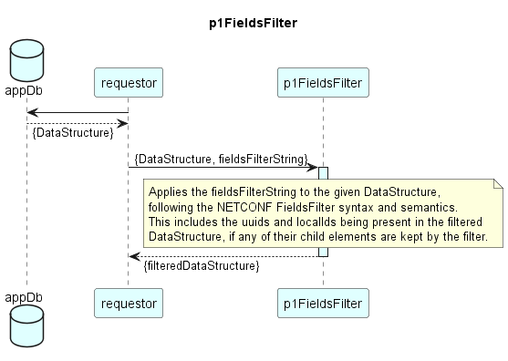

# FieldsFilter  

### Overview  

The FieldsFilter Function shall filter a provided data structure.  
Its syntax and its filtering of data shall follow the FieldsFilter of the NETCONF definitions.  

### Diagram  

  

### Interface  

Please find a detailed description of the [interface](./interface.yaml).  

### NPM Module  

[mw-sdn-p1FieldsFilter](https://www.npmjs.com/package/mw-sdn-p1FieldsFilter)  

