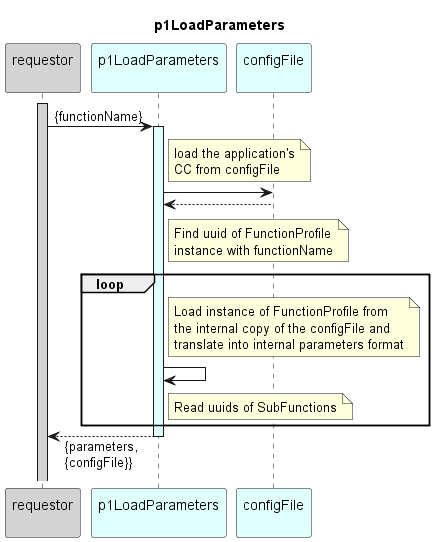

# p1LoadParameters  

Loads the parameters of the defined Function (input) and its sub-Functions from the configFile and returns it in the internal recursive parameters format.  

### Diagram  

  
  

  

### Interface  

Please find a detailed description of the [interface](./interface.yaml).  

### NPM Module  

[mw-sdn-p1LoadParameters](https://www.npmjs.com/package/mw-sdn-p1LoadParameters)  

